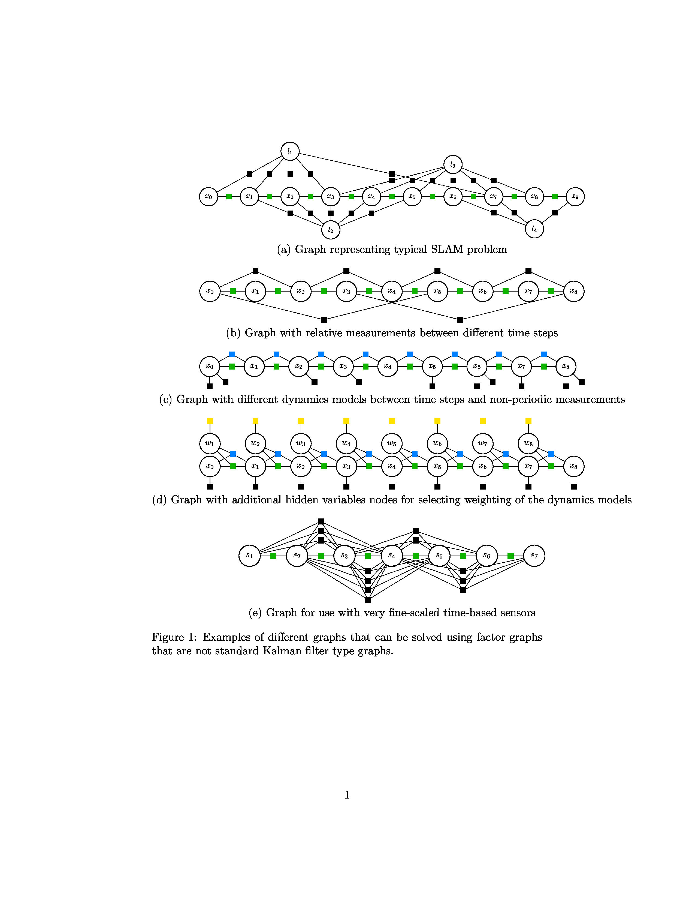
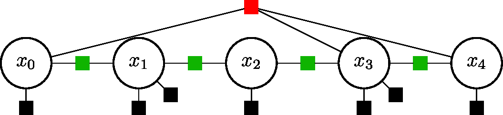
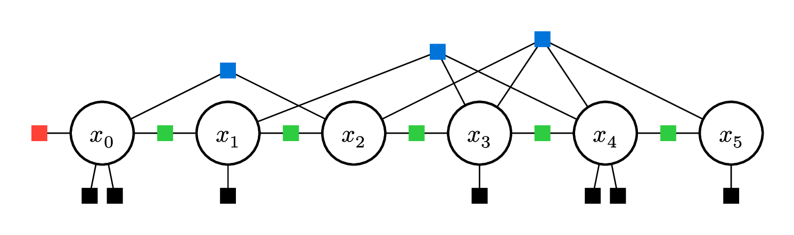

# Drawing factor graphs for papers
This is some code to draw nice looking factor graphs, mainly for papers.  I have done this two ways.  
1.  Python/LaTeX.  I originally created some Python code that generated LaTeX/TikZ code.  This repository holds this code
2.  I found I could do both of the above in [typst](https://typst.app/).  For the typst version see [this project](https://typst.app/project/ruT5ks9pNoYEEBqWuDIDUg)

## Why LaTeX/TikZ or Typst
When I am creating factor graphs, I want it to hold nice mathematical symbols inside of the graph.  So for pretty graphs, with math, I found these techniques worked much better than graphviz, or PowerPoint, or...  I wanted a language that understands how to display math to begin with, which both LaTeX and Typst do.

## LaTeX examples
There are several examples of creating graphs using LaTeX in this repository.  The trick is to use TikZ commands to create a "hidden variable" and "factor" type of nodes, then to place them in nice patterns.  An example of doing this directly in LaTex is in the [latex_example.tex](latex_example.tex) file. (Also in Overleaf [here](https://www.overleaf.com/read/sbbnpymqwcsn#885f12)) This generates the following set of graphs:

I have also used Python code to generate the graphs, as shown in [quad_graph.py](quad_graph.py).  This code has a function, `write_LaTeX_graph_preamble(f)`, which generates the preamble for the LaTeX file, and a function, `LaTeX_graph_from_sp_matrix(A, filename)`, which generates the LaTeX file given a matrix A that represents a factor graph.  The example in the Python file generates the following graph (note that the Python runs LaTeX and imageMagick at the end, so if you don't have those programs installed, the Python code will fail at the end):

## Typst examples
The best way to see this example is to go to the typst website [this project](https://typst.app/project/ruT5ks9pNoYEEBqWuDIDUg).  This Typst version is almost a combination of Python and LaTeX from above, but compiles much more quickly.  This code uses a package called Fletcher to draw edges between nodes.  By changing parameters at the top of the file, the number of nodes, factors, etc. can be changed.  The Typst example generates the following graph:

